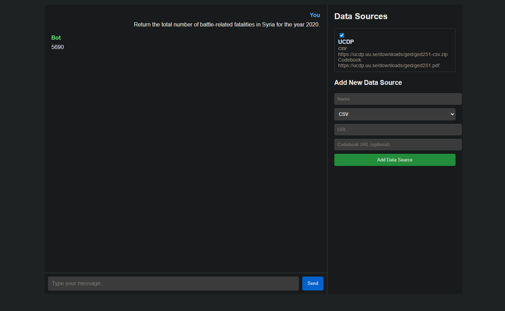

# POLARIS-IR

POLARIS-IR is like Google NotebookLM for structured data — a multi-agent AI backend that analyzes datasets instead of just summarizing text. Where NotebookLM helps researchers make sense of documents, POLARIS-IR helps analysts and policymakers extract insights from CSVs, codebooks, and quantitative sources.

This repository contains the backend for the **POLARIS-IR** (Policy & Open-source LLM Analytics for Relations & International Security) assistant. The goal of this project is to create an AI-powered platform that can analyze data from various sources to answer questions about international security.

## Features

- **FastAPI backend** with a multi-agent architecture.
- **Retrieval-Augmented Generation (RAG)** pipeline for data analysis.
- **Function calling** for reliable and secure data analysis.
- **Dynamic data source management:** Add and select data sources (CSV files with optional PDF codebooks) through the user interface.
- **Local LLM integration** with Ollama.
- **Docker support** for easy deployment.

## Technical Implementation

This project demonstrates several key AI engineering and GenAI techniques:

### Multi-Agent Architecture

The application uses a multi-agent system to handle user requests. This approach allows for a clear separation of concerns and makes the system more modular and scalable. The main agents are:

- **OrchestratorAgent:** The main agent that receives the user's query and orchestrates the work of the other agents.
- **DataSourceAgent:** Responsible for managing and loading data from the selected data sources.
- **CodebookAgent:** Parses and understands codebooks to provide context to the other agents.

### Retrieval-Augmented Generation (RAG)

The system uses a RAG pipeline to answer questions based on the data from the selected data sources. The RAG process involves:

1.  **Retrieval:** The `DataSourceAgent` retrieves the data from the selected data source, and the `CodebookAgent` retrieves the context from the codebook.
2.  **Augmentation:** The retrieved data and codebook context are used to augment the prompt sent to the language model.
3.  **Generation:** The language model generates a response based on the augmented prompt.

### Function Calling

To ensure reliable and secure data analysis, the system uses a function-calling approach. Instead of asking the LLM to generate Python code, the system provides the LLM with a set of predefined data analysis functions. The LLM's task is to choose the appropriate function and its parameters to answer the user's question. This approach is more secure than executing arbitrary code from the LLM and more reliable as the data analysis is performed by well-defined Python functions.

## Project Structure

```
polaris-ir/
├── src/
│   └── polaris/
│       ├── agents/              # Contains the different agents
│       │   ├── base.py
│       │   ├── orchestrator.py
│       │   ├── data_source.py
│       │   └── codebook.py
│       ├── api/                 # FastAPI routers
│       ├── core/                # Core configuration
│       ├── data/                # Directory for storing downloaded data
│       ├── services/            # Services for data loading and analysis
│       ├── static/              # Static files for the frontend
│       └── main.py              # FastAPI entrypoint
├── .gitignore
├── docker-compose.yml
├── Dockerfile
├── requirements.txt
└── README.md
```

## Usage

### 1. Installation

Install the Python dependencies with pip:

```bash
pip install -r requirements.txt
```

### 2. Running the Application

Run the application using Docker Compose:

```bash
docker-compose up --build
```

The application will be available at `http://localhost:8001`.

### 3. How to Use the Data Analysis Features

1.  **Add a data source:** Use the form on the right side of the page to add a new data source. You will need to provide a name, a URL to a CSV file, and an optional URL to a PDF codebook.
2.  **Select a data source:** Once you have added a data source, it will appear in the list. Use the checkbox to select the data source you want to use for your analysis.
3.  **Ask a question:** Type your question in the chat input field and press Enter. The bot will analyze the data from the selected data source and return the answer.

## Docker

To run the backend in a container, build and start the service using Docker Compose:

```bash
docker-compose up --build
```

This will build the image and run the API on `localhost:8001` by default.

## Screenshot

**Please add a screenshot of the application dashboard and name it `screenshot.png`.**



## Contributing

Contributions are welcome! Please open an issue or submit a pull request.

## License

This project is licensed under the MIT License. See the [LICENSE](LICENSE) file for details.
